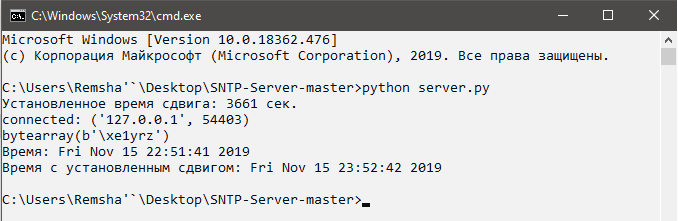

# Simple Network Time Protocol
Простой SNTP сервер, который врёт на N секуд указанных в файле conf.txt. 

### Цель работы
  - Познакомиться с протоколом SNTP/NTP
  - Работа с сокетами

### Запуск сервера
```
python server.py
```

### Запуск клиента
```
python client.py
```

### Как работает

  - Получаем пакет от правдивый NTP-сервер
  - Изменяем 40-47 байт, содержащий информацию о времени на N секунд
  - Пробрасываем пакет клиенту

### Изображение


### Зависимости
- Python3
- ntplib

### Автор
Ремша Игорь, 2019
